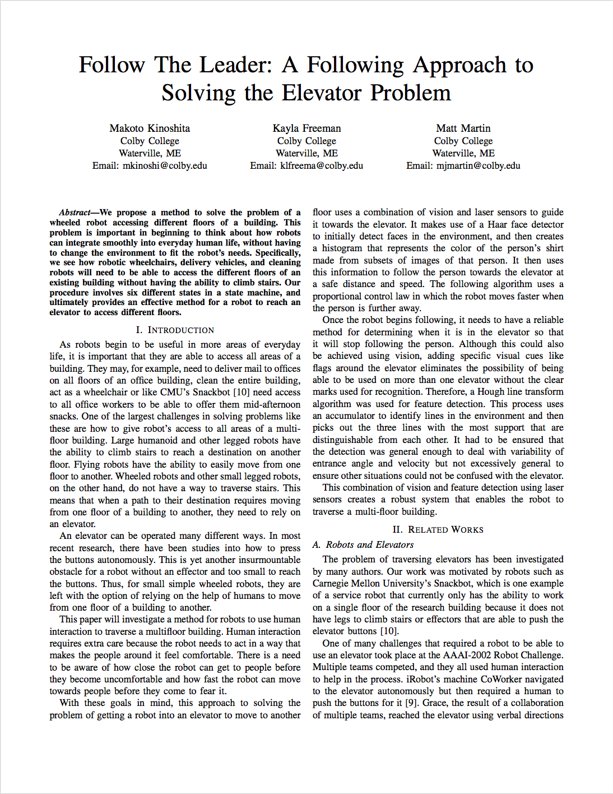

# self drive robot
We build a self drive mobile robot using C/C++ that detects human beings and ask them to take the robot to an elevator. Using the motion detector, this robot follows the person.

[Read the whole paper](./automobile_robot.pdf)
